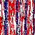
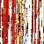

# MarkovChainImageGeneration
Uses a Markov Chain to generate an image from an input image. There is a tendency to generate long vertical lines, but that is due to the fact that it is percieving the changes in pixels in a long line from the input, to have a truly "generated image" it would need to take into account multi-directional state changes. 

  
  
  
  

